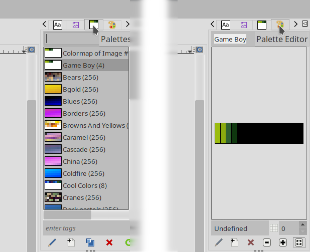
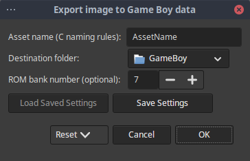

Palette
=======

[Game-Boy.gpl](Game-Boy.gpl) is a GIMP color palette that contains the 4 colors
the original Game Boy console uses (shades of green). If you prefer it, there is
also another file, [Game-Boy-Pocket.gpl](Game-Boy-Pocket.gpl), with the Game Boy
Pocket palette (shades of gray).

Install
-------

To install it, either copy the file yourself to your GIMP's palette location (by
default it is `$HOME/.config/GIMP/<VERSION>/palettes/` on Linux, or
`C:\Users\<USER>\AppData\Roaming\GIMP\<VERSION>\palettes\` on Windows, you can
check this in *Edit->Preferences->Folders->Palettes*); or run GIMP, activate
menu *Windows->Dockable Dialogs->Palettes* to open the palette list in the right
side bar, and then right-click the list and choose *Import Palette...*, and
select *Palette file* as the source. Point to the .gpl file and click
*[Import]*.

Create image
------------

1. Create a new image, dimensions multiples of 8 pixels, 256x256 maximum (the GB
   screen is 160x144, but the VRAM background size is 256x256).
2. *Image->Mode->Indexed...* and choose *Use custom palette*.
3. Select *Game Boy (4)* or *Game Boy Pocket (4)*, which should be at the
   beginning of the palette list. In parentheses is the number of colors of each
   palette.
4. Be sure to **uncheck _Remove unused and duplicate colors from colormap_**!
5. Click *[Convert]*.
6. Open the [palette tab](https://docs.gimp.org/3.0/en/gimp-palette-dialog.html)
   (*Windows->Dockable Dialogs->Palettes*), right click the Game Boy palette in
   the list, select *Edit Palette...*. A new tab (Palette Editor) should open
   next to the Palettes one.
7. You should now see the 4 colors and their names, click *[Zoom all]* to make
   them bigger (the button to the right of the **+** one).

You can click any color to choose it as foreground color and paint on the image.
I recommend enabling the grid (*View->Show Grid*). If it is not the right size,
go to *Image->Configure Grid...* and set both horizontal and vertical spacing to
8 pixels (to better plan your tiles) or 1 pixel (for precision artwork), and to
use the Pencil Tool (`N`) with brush number 1 (single-pixel brush). These
settings will be stored in the .xcf GIMP image file.

Try not to make the image too complex. The Game Boy's video memory has space for
128 sprite patterns, 128 background tiles, and 128 shared by both. That is, you
can have up to 256 background tiles at any moment (384 using a hack), yet a
fullscreen sized image (160x144 pixels) with no duplicate tiles would need 360.
An image with many empty or repeating tiles is preferrable to one where every
tile is unique.

Needless to say, you should make good use of the *Image->Crop to content* GIMP
command to make sure the image contains as little data as possible (check that
the dimensions are still multiples of 8 after running it). GBDK-2020 allows you
to place a background beginning at a specific horizontal and vertical offset, so
there is no need for you to align and/or center content by adding padding space
in GIMP. You will adjust that from your code later.

Import image
------------

If you want to use an existing image, my recommendation is that you first
convert it to 4-color indexed mode using the palette (make sure you enable good
quality dithering), then downsize it using cubic interpolation or some other
algorithm. If you copy from another image, be sure to use *Image->Flatten Image*
to merge all layers.

Plug-in
=======

`Image2GB` is a GIMP plug-in that allows you to export an image directly to GBDK
(Game Boy Development Kit) format, e.g. in order to create assets for use with
the most recent [GBDK-2020](https://github.com/gbdk-2020/gbdk-2020). The only
**image prerequisites** are that:

1. Sizes must be multiples of 8 (as a GB tile is 8x8 pixels).
2. It must not be bigger than 256x256 pixels.
3. It must be an indexed, 4-color image.

They are all trivial to meet using GIMP and the previous palette.

There are precompiled releases of this plug-in available
[here](https://github.com/DaSalba/Image2GB/releases). If you prefer to compile
it yourself, see the next two sections.

Linux
-----

To build and install the plug-in, just run this command in this directory:

	gimptool-3 --install image2gb.c

It will automatically compile the plug-in and copy it to
`$HOME/.config/GIMP/<VERSION>/plug-ins/`. If you get a "command not found"
error, make sure you have GIMP 3 and the necessary packages installed
(`libgimp3.0-dev` on Debian, `gimp-devel-tools` on Fedora).

Windows
-------

The procedure is the same, but it requires you to install and configure both
MSYS2 and Clang, which is a hassle. The binary in `C:\Program Files\GIMP 3\bin\`
will not work, complaining about "pkg-config not recognized". Linux would be my
choice, but if you still want to do it, the steps are:

1. Download and install [MSYS2](https://www.msys2.org).
2. Follow instructions to [update it](https://www.msys2.org/docs/updating),
   which can be summarized as running `MSYS2 MSYS` and executing the command
   `pacman -Suy`).
3. Run `MSYS2 CLANG64`.
4. Install the required dependencies:

		pacman -S mingw-w64-clang-x86_64-clang mingw-w64-clang-x86_64-pkg-config mingw-w64-clang-x86_64-gimp

5. Copy the plug-in's source files (.h and .c) to `C:\msys64\home\<USER>\` (that
   should be the default HOME folder unless you changed it during installation,
   and it is also the folder the MSYS2 terminal should load at startup, so you
   should be there already, check this with `pwd` and `ls`).
6. Run the following command to build and install:

		gimptool-3.exe --install image2gb.c

It will compile the plug-in and place it in
`C:\Users\<USER>\AppData\Roaming\GIMP\<VERSION>\plug-ins\`. If it fails with an
error message saying "no such file or directory", copy the full clang command
(with all parameters), paste it at the command line, and edit it to remove the
single quotes (`'`) around the input file name (change `'image2gb.c'` to
`image2gb.c`). If the error says "cannot open output file", edit the output
path (the parameter preceded by `-o`) to change all backslashes (`\`) to forward
slashes (`/`).

Usage
-----

Start GIMP, create or load an indexed 4-color image using the Game Boy palette,
make sure it is 256x256 or smaller, and export it. You have two options (both
give the same final product):

1. *Tools->Game Boy (GBDK-2020)*. It will always show the export dialog.
2. *File->Export...*, then save it as a .gbdk or choose *Game Boy (GBDK-2020)*
   from the file type dropdown list. The first time it will show the dialog, the
   next time you can just choose *File->Export to \<NAME\>.gbdk* or hit *CTRL+E*
   to export it again with the last used options, skipping the dialog (quicker).

In the self-explanatory plug-in export dialog, just input the name you want for
the asset (try to keep it short and a valid C identifier, it will be the base
name for the variables), choose the destination path by clicking the widget, and
set the ROM bank number (0 for using the default bank). Click *[OK]*. The
plug-in will generate two files, a .h header and a .c source file, containing
the asset and everything else needed.

To show it in your GBDK-2020 game, add the two files to your project and use
code like this (replace "Name" and "NAME" accordingly):

	// Load the tile data at the start of VRAM.
	set_bkg_data(0U, BACKGROUND_NAME_TILES, BackgroundDataName);
	// Load and set the tile map at screen origin.
	set_bkg_tiles(0U, 0U, BACKGROUND_NAME_SIZE_X, BACKGROUND_NAME_SIZE_Y, BackgroundMapName);
	// Enable the background layer.
	SHOW_BKG;
	// Turn the display on.
	DISPLAY_ON;

In case you chose a ROM bank number different than 0, do not forget to switch to
it (with `SWITCH_ROM(BANK(BACKGROUND_NAME));` for example) before trying to
load the background. Of course, you will have to place the asset in the proper
bank during compilation.

The syntax and code formatting follow the same conventions I use in my source
code, but it is very easy to modify if you want to. Edit
[source_strings.h](source_strings.h) and [image_export.h](image_export.h) to
suit your needs.

Troubleshooting
===============

**Q1: GIMP does not let me paint on the image after converting it to indexed
      mode.**

**A1:** Did you forget to uncheck *Remove unused and duplicate colors from
        colormap*? If checked, GIMP removes all but the first palette color (the
        default one used for the background), so you cannot paint with others,
        and you cannot export either.

**Q2: I cannot run the plug-in, the menu option is greyed out.**

**A2:** See error above. Also, sometimes GIMP seems to get "stuck" despite
        converting the image to indexed mode, and thinks it is still RGB. To fix
        that, create a new image following the instructions, make sure you can
        export it, then copy the other one and paste. Remember to flatten the
        image to merge all layers. If the error persists, remove GIMP's config
        directory in your `$HOME` (if Linux) or user `AppData\` (if Windows).

**Q3: Only the first 2/3 of the image is rendered OK, the rest is repetition.**

**A3:** The image is too complex, and the plug-in warned you when you exported
        it. As I explained above, GB only supports up to 256 unique tiles.
        Search for "Game Boy tile overlap hack" to see how to get past that
        limit.

**Q4 I cannot find `gimptool-3[.exe]` in my system, yet GIMP [and MSYS2] are
     installed.**

**A4** You are probably running the legacy 2.0 version of GIMP. Since early
       2025 version 3.0 is the default stable branch, so you should update. If
       you do not want or are unable to, download an older v1.x
       [release](https://github.com/DaSalba/Image2GB/releases) of my plug-in.
       From v2.0 onwards only GIMP 3 is supported.

**Q5: Could I use your plug-in to create my game maps and tilesets?**

**A5:** Theoretically, you could, but there are far better tools for that such
        as [GBMB](https://github.com/gbdk-2020/GBTD_GBMB) and
        [Tiled](https://www.mapeditor.org/). My plug-in is meant for high
        quality artwork (even photos) that you may want to export to your ROM,
        such as a splash screen or menu background. GIMP is not much of a level
        editor, plus the plug-in is limited to 256x256 pixels images.
