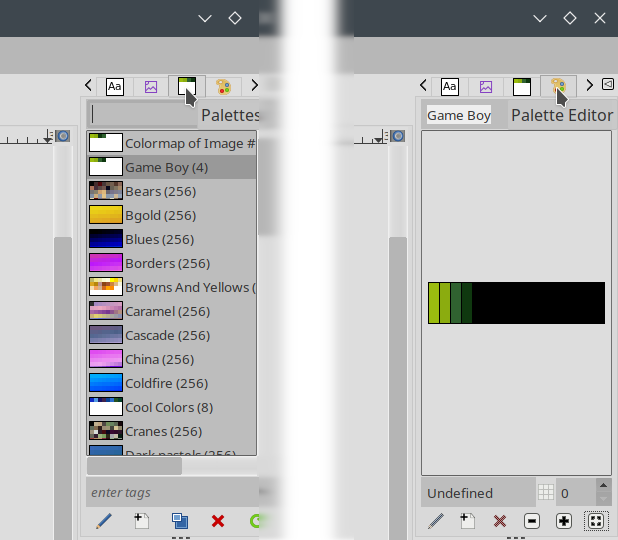

Palette
=======

Install
-------

`Game-Boy.gpl` is a GIMP color palette that containts the 4 colors the original
Game Boy uses. To install it, either copy the file yourself to the directory
`$HOME/.config/GIMP/<VERSION>/palettes/` on Linux
(`C:\Users\<USER>\AppData\Roaming\GIMP\<VERSION>\palettes\` on Windows), or run
GIMP, choose *Windows->Dockable Dialogs->Palettes* to open the palette list in
the right side menu bar. Then, right-click the list and choose
*Import Palette...*, and choose *Palette file* as the source. Point to the .gpl
file and click *[Import]*.

Create image
------------

1. Create a new image, 160x144 (or 256x256 maximum).
2. *Image->Mode->Indexed...* and choose *Use custom palette*
3. Select *Game Boy (4)*, which should be at the beginning of the list.
4. Be sure to **uncheck _Remove unused and duplicate colors from colormap_**!
5. Click *[Convert]*.
6. Open the palette list (*Windows->Dockable Dialogs->Palettes*), right click
   the Game Boy palette in the list, select *Edit Palette...*. A new tab
   (Palette Editor) should open next to the Palettes one.
7. You should now see the 4 colors and their names, click *[Zoom all]* to make
   them bigger (the *[: :]* button to the right of the *+* one).

You can click any color to choose it as foreground color and paint on the image.
I recommend enabling the grid (*View->Show Grid*, if it is not the right size,
go to *Edit->Preferences*, *Default Grid*, and set both
*Horizontal and Vertical Spacing* to 1 pixel), and to use the Pencil Tool with
size 1 to paint single pixels.

Try not to make the image too complex. The Game Boy's video memory has space for
128 sprite tiles, 128 background tiles, and 128 shared by both. That is, you can
have up to 256 background tiles at any moment (384 using a hack), yet a full
sized image (160x144 pixels) with no duplicate tiles would need 360.

Import image
------------

If you want to use an existing image, my recommendation is that you fist convert
it to 4-color indexed mode using the palette (make sure you enable good quality
dithering), then downsize it using cubic interpolation or some other algorithm.
If you copy from another image, be sure to use *Image->Flatten Image* to merge
all layers.

Plugin
======

`Image2GB` is a GIMP plugin that allows to export an image directly to GBDK
data. The only prerequisites are that the image must not be bigger than 256x256
pixels (and sizes must be multiples of 8), and that it must be an indexed,
4-color image. They are all trivial to meet using GIMP and the palette above.

Linux
-----

To install the plugin, just run this command in this folder:

	gimptool-2.0 --install image2gb.c

It will automatically compile the plugin and copy it to
`$HOME/.config/GIMP/<VERSION>/plug-ins/`.

Windows
-------

The procedure is the same, but it requires you to install and configure both
MSYS2 and MinGW, which is a hassle. The binary in `C:\Program Files\GIMP 2\bin\`
will not work, complaining about "pkg-config not found":

	.\gimptool-2.0.exe --install .\image2gb.c

Linux would be my choice. If you still want to do it, the steps are:

1. Download and install [MSYS2](https://www.msys2.org/) (follow instructions to
   update it).
2. Run MSYS2 MinGW (32 or 64-bit according to your OS, the next steps use 64).
3. Run:

	`pacman -S mingw-w64-x86_64-gimp mingw-w64-x86_64-gcc mingw-w64-x86_64-pkg-config`

4. Copy the .h and .c files to `C:\msys64\home\<USER>\` (for example).
5. Run `gimptool-2.0.exe --install ./image2gb.c` to build and install.

It will compile the plugin and place it in
`C:\Users\<USER>\AppData\Roaming\GIMP\<VERSION>\plug-ins\`. If GCC fails with
some message saying "No such file or directory", copy the full command (with all
GCC options) and replace the compiler binary (e.g. `x86_64-w64-mingw32-gcc`) for
just `gcc` and it should work.

Usage
-----

Start GIMP, create or load an indexed 4-color image using the Game Boy palette,
make sure it is 256x256 or smaller, and export it. You have 2 options (both give
the same final product):

1. *Tools->Game Boy (GBDK)*. It always shows the export dialog.
2. *File->Export As...*, then save it as .gbdk or choose *Game Boy (GBDK)*
   from the file type list. The first time it will show the dialog, the next
   time you can just choose *File->Export to <NAME>.gbdk* or hit *CTRL+E* to
   export it again with the same options (quicker).

In the self-explanatory plugin export dialog, just input the name you want for
the asset (try to keep it short and a valid C identifier, it will be the base
name for the variables), choose the destination folder by clicking the button,
and set the ROM bank number (0 for no bank). Click *[Export]*. The plugin will
produce two files, a .h header and a .c source file, containing the asset and
everything else needed.

To use them in your game with GBDK:

	// Load the tile data (GAME_BACKGROUNDS_NAME_TILES equals the actual number of tiles).
	set_bkg_data(0U, GAME_BACKGROUNDS_NAME_TILES, BkgDataName);
	// Draw the map to the whole screen (a tile is 8x8).
	set_bkg_tiles(0U, 0U, GAME_BACKGROUNDS_NAME_SIZE_X, GAME_BACKGROUNDS_NAME_SIZE_Y, BkgMapName);
	// Show the background layer.
	SHOW_BKG;
	// Turn the display on.
	DISPLAY_ON;

The syntax and code formatting follow the same conventions I use in my source
code, but it is very easy to modify if you want to.

Troubleshooting
===============

**Q1:** GIMP does not let me paint on the image after converting it to indexed
        mode.

**A1:** Did you forget to uncheck
        *Remove unused and duplicate colors from colormap*? If checked, GIMP
        seems to remove all but the background color, so you can't paint other
        colors, and you can't export either.

**Q2:** I can't run the plugin, the menu option is greyed out.

**A2:** See error above. Also, sometimes GIMP seems to get "stuck" despite
        converting the image to indexed mode, and thinks it still is RGB. To fix
        that, create a new image following the instructions, make sure you can
        export it, then copy the other one and paste. Remember to flatten the
        image to merge all layers. If the error persists, remove GIMP's config
        folder (in your $HOME).

**Q3:** Only the first 2/3 of the image is rendered OK, the rest is repetition.

**A3:** The image is too complex, and the plugin warned you when you exported
        it. As I explained above, GB only supports up to 256 unique tiles.
