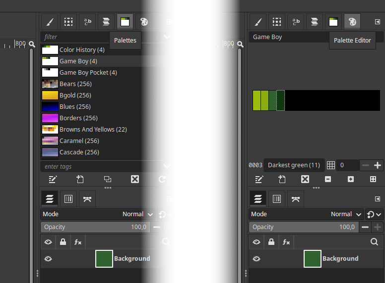

Palette
=======

`Game-Boy.gpl` is a GIMP color palette that contains the 4 colors the original
Game Boy console uses (shades of green). If you prefer it, there is also another
file, `Game-Boy-Pocket.gpl`, with the Game Boy Pocket palette (shades of gray).

Install
-------

To install it, either copy the file yourself (to the directory
`$HOME/.config/GIMP/<VERSION>/palettes/` on Linux, or
`C:\Users\<USER>\AppData\Roaming\GIMP\<VERSION>\palettes\` on Windows), or run
GIMP, activate menu *Windows->Dockable Dialogs->Palettes* to open the palette
list in the right side bar, and then right-click the list and choose
*Import Palette...*, and select *Palette file* as the source. Point to the .gpl
file and click *[Import]*.

Create image
------------

1. Create a new image, dimensions multiples of 8 pixels, 256x256 maximum (the GB
   screen is 160x144).
2. *Image->Mode->Indexed...* and choose *Use custom palette*.
3. Select *Game Boy (4)* (or the Pocket version), which should be at the
   beginning of the palette list. In parentheses is the number of colors of each
   palette.
4. Be sure to **uncheck _Remove unused and duplicate colors from colormap_**!
5. Click *[Convert]*.
6. Open the palette menu (*Windows->Dockable Dialogs->Palettes*), right click
   the Game Boy palette in the list, select *Edit Palette...*. A new tab
   (Palette Editor) should open next to the Palettes one.
7. You should now see the 4 colors and their names, click *[Zoom all]* to make
   them bigger (the *[: :]* button to the right of the *+* one).

You can click any color to choose it as foreground color and paint on the image.
I recommend enabling the grid (*View->Show Grid*, if it is not the right size,
go to *Edit->Preferences*, *Default Image->Default Grid*, and set both
*Horizontal and Vertical Spacing* to 1 pixel), and to use the Pencil Tool (`N`)
with brush number 1 (single-pixel brush).

Try not to make the image too complex. The Game Boy's video memory has space for
128 sprite tiles, 128 background tiles, and 128 shared by both. That is, you can
have up to 256 background tiles at any moment (384 using a hack), yet a
fullscreen sized image (160x144 pixels) with no duplicate tiles would need 360.

Needless to say, you should make good use of the *Image->Crop to content* GIMP
command to make sure the image contains as little data as possible (check that
the dimensions are still multiples of 8 after running it). GBDK-2020's functions
allow you to place a background beginning at a specific horizontal and vertical
offset, so there is not need for you to align and/or center content by adding
padding space in GIMP. You will adjust that from your code later.

Import image
------------

If you want to use an existing image, my recommendation is that you first
convert it to 4-color indexed mode using the palette (make sure you enable good
quality dithering), then downsize it using cubic interpolation or some other
algorithm. If you copy from another image, be sure to use *Image->Flatten Image*
to merge all layers.

Plugin
======

`Image2GB` is a GIMP plugin that allows to export an image directly to GBDK
(Game Boy Development Kit) format, e.g. in order to create assets for use with
the most recent [GBDK-2020](https://github.com/gbdk-2020/gbdk-2020). The only
**image prerequisites** are that:

1. Sizes must be multiples of 8 (as a GB tile is 8x8 pixels).
2. It must not be bigger than 256x256 pixels.
3. It must be an indexed, 4-color image.

They are all trivial to meet using GIMP and the previous palette.

There are precompiled releases of this plugin available
[here](https://github.com/DaSalba/Image2GB/releases). If you prefer to compile
it yourself, see the next two sections.

Linux
-----

To build and install the plugin, just run this command in this folder:

	gimptool-2.0 --install image2gb.c

It will automatically compile the plugin and copy it to
`$HOME/.config/GIMP/<VERSION>/plug-ins/`. If you get a "command not found"
error, make sure you have `libgimp2.0-dev` (`gimp-devel-tools` on Fedora)
installed on your system.

Windows
-------

The procedure is the same, but it requires you to install and configure both
MSYS2 and MinGW, which is a hassle. The binary in `C:\Program Files\GIMP 2\bin\`
will not work, complaining about "pkg-config not found". Try the following
command and see for yourself:

	.\gimptool-2.0.exe --install .\image2gb.c

Linux would be my choice. If you still want to do it, the steps are:

1. Download and install [MSYS2](https://www.msys2.org) (follow instructions to
   [update it](https://www.msys2.org/docs/updating)).
2. Run MSYS2 MINGW (32 or 64-bit according to your OS, the next steps use
   `MSYS2 MINGW64`).
3. Install the required dependencies:

		pacman -S mingw-w64-x86_64-gimp2 mingw-w64-x86_64-gcc mingw-w64-x86_64-pkg-config

4. Copy the plugin's source files (.h and .c) to `C:\msys64\home\<USER>\` (that
   should be the default HOME folder unless you changed it during installation,
   and it is also the folder the MSYS2 terminal should load at startup, so you
   should be there already, check this with `pwd`).
5. Run `gimptool-2.0.exe --install ./image2gb.c` to build and install.

It will compile the plugin and place it in
`C:\Users\<USER>\AppData\Roaming\GIMP\<VERSION>\plug-ins\`. If it fails with
some message saying "cannot open output file", copy the full GCC command (with
all parameters), paste it at the command line, and edit the output path (the
parameter preceded by `-o`) to change all backslashes (`\`) to forward slashes
(`/`). Then run it, and it should work.

Usage
-----

Start GIMP, create or load an indexed 4-color image using the Game Boy palette,
make sure it is 256x256 or smaller, and export it. You have 2 options (both give
the same final product):

1. *Tools->Game Boy (GBDK-2020)*. It always shows the export dialog.
2. *File->Export As...*, then save it as .gbdk or choose *Game Boy (GBDK-2020)*
   from the file type dropdown list. The first time it will show the dialog, the
   next time you can just choose *File->Export to <NAME>.gbdk* or hit *CTRL+E*
   to export it again with the last used options (quicker).

In the self-explanatory plugin export dialog, just input the name you want for
the asset (try to keep it short and a valid C identifier, it will be the base
name for the variables), choose the destination folder by clicking the button,
and set the ROM bank number (0 for using the default bank). Click *[Export]*.
The plugin will generate two files, a .h header and a .c source file, containing
the asset and everything else needed.

To use it in your game with GBDK-2020, add the two files to your project and:

	// Load the tile data at the start of VRAM.
	set_bkg_data(0U, BACKGROUND_NAME_TILES, BackgroundDataName);
	// Load and set the tile map at screen origin.
	set_bkg_tiles(0U, 0U, BACKGROUND_NAME_SIZE_X, BACKGROUND_NAME_SIZE_Y, BackgroundMapName);
	// Enable the background layer.
	SHOW_BKG;
	// Turn the display on.
	DISPLAY_ON;

In case you chose a ROM bank number different than 0, do not forget to switch to
it (with `SWITCH_ROM(BANK(BACKGROUND_NAME))` for example) before trying to
load the background.

The syntax and code formatting follow the same conventions I use in my source
code, but it is very easy to modify if you want to. Edit `source_strings.h` to
suit your needs.

Troubleshooting
===============

**Q1:** GIMP does not let me paint on the image after converting it to indexed
        mode.

**A1:** Did you forget to uncheck *Remove unused and duplicate colors from
        colormap*? If checked, GIMP seems to remove all but the background
        color, so you can not paint other colors, and you can not export either.

**Q2:** I can not run the plugin, the menu option is greyed out.

**A2:** See error above. Also, sometimes GIMP seems to get "stuck" despite
        converting the image to indexed mode, and thinks it still is RGB. To fix
        that, create a new image following the instructions, make sure you can
        export it, then copy the other one and paste. Remember to flatten the
        image to merge all layers. If the error persists, remove GIMP's config
        folder (in your $HOME).

**Q3:** Only the first 2/3 of the image is rendered OK, the rest is repetition.

**A3:** The image is too complex, and the plugin warned you when you exported
        it. As I explained above, GB only supports up to 256 unique tiles.
        Search for "Game Boy tile overlap hack" to see how to get past that
        limit.

**Q4** I can not find `gimptool-2.0[.exe]` in my system, yet GIMP [and MSYS2]
       are installed.

**A4** You are running version 3.0 of GIMP, released early 2025. I still have to
       update my plugin to make it compatible with that version, which has
       changed several things. It uses `gimptool-3.0[.exe]`.

**Q5:** Could I use your plugin to compose my game maps and tilesets?

**A5:** Theoretically, you could, but there are far better tools for that such
        as [GBMB](https://github.com/gbdk-2020/GBTD_GBMB) and
        [Tiled](https://www.mapeditor.org/). My plugin is meant for high quality
        artwork (even photos) that you may want to export to your ROM, such as a
        splash screen or menu background. GIMP is not much of a level editor.
